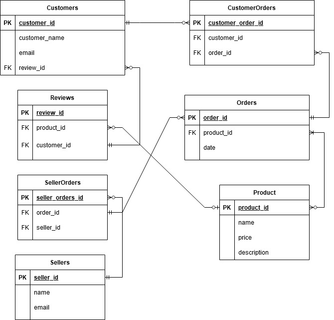

# NathanEwan T2A1 Workbook

## 1. Describe the architecture of a typical Rails application<br></br>

Ruby on Rails operates using an architectural pattern known as MVC (Models, Views, Controllers). The purpose of developing a web application using MVC is to divide the application into three separate parts, each serving different functions but working together to produce the end result. The typical flow/structure of a Rails application starts when a user makes a request through their web browser to access a website’s URL. This request is then sent to the webserver which then forwards the request to the router. In the case of a Rails application, the routes are handled by a file called routes.rb that uses the HTTP request method (GET, POST, DELETE, PUT) and path to call a specific controller action. The controller can be seen as the middleman between the model and view of the application. In an MVC architecture the model and view do not directly interact with each other but instead use the controller as an intermediary. The controller itself does not handle any data logic, and focuses on handling request flow through specific controller actions such as, index, new, create, update, delete, edit, etc. 

After the controller has received the request, it interacts with the model to perform any CRUD operations. The model’s purpose is to handle data and interact with the database. The Model also defines the relation between the other models within the application such as one to many, one to one, and many to many relationships. Validations are also managed within the model to check if the user entered data that is valid with respect to the requirements and constraints set within the database table. As mentioned, before it is also important to know that the model is used to interact directly with the database. This may include DBMS such as, PostgreSQL, MySQL, NoSQL, etc. Once the data has been retrieved from the database the model sends the appropriate information back to the controller. 

Finally, the controller interacts with the view to render a display to their web browser. The view is the front-end of the application and is designed to display information directly to the browser. This is done in rails using html.erb files named accordingly to the controller action that they perform. These .erb files are html files that allow ruby code to be embedded inside of them so that the view can display information that the controller has retrieved. Views can also be styled with CSS and take the form of not just html files but also PDF, RSS, XML and more. <br></br>

## 2. Identify a database management system (DBMS) commonly used in web applications (including Rails) and discuss the pros and cons of this database <br></br>

MySQL is a popular database management system used widely for many purposes such as e-commerce, apps, web servers and dynamic websites. MySQL is feature rich without requiring a high level of training to learn or operate the system, reducing the need for business owners to invest in training employees or developers wasting time on learning a new system. It also provides a wide range of support for almost all programming languages like, Python, C, C++, PHP, Ruby, Java, JavaScript and so on. MySQL has the added advantage of being open source, meaning that it is highly affordable and more secure as any one can access source code so problems can be resolved quickly. As a business it is crucial to have a secure database to protect from any potential breach of private user information. Fortunately, MySQL is a very reliable platform and handles security well. For example, it provides secure data encryption, authentication services, secure connections and so on. MySQL also comes with assurance of 24x7 uptime, providing both server clustering and replication. Finally, this DBSM is highly reliable when it comes to transactional support. MySQL allows for multi-transactional support, and full data integrity so that customers are transactional data is secured. 
Though MySQL has many benefits there are drawbacks as well, including that some tools and features are not included like full-text searching which is not available out of the box and require add ons. MySQL also does not implement the full SQL standard, meaning that it is not fully SQL compliant and may face some issues when migrating to other DBMS’s. It also faces difficulty when the data size grows. Though it is scalable it is not easy and is more focused on small to medium sized business’ rather than large scale enterprises. <br></br>

## 3. Discuss the implementation of the agile project management methodology<br></br>

Agile project management is a methodical approach to software development used frequently by software development teams including major tech companies like Apple, Facebook, and Spotify. The core principles behind agile project management are as follows, individuals and interactions over processes and tools, working software over comprehensive documentation, customer collaboration over contract negotiation, responding to change over following a plan. It is important to note that aspects of software development such as, documentation, planning and processes should not be completely ignored or outright neglected. Instead, the aim of agile project development is to deliver a piece of software that adheres to the core principles. Agile operates as a cycle between the end users and the development team, which ultimately provides software developers with a flexible system that allows them to react quickly to customer demands and make improvements to the product throughout the development process. This cycle is made up of 3 key components user stories, stand-ups/meetings, and sprints.

Implementing agile project management begins with a vision and product roadmap. Before you begin working on a new project you need to have an outline of what the main goal of the project is. This is where the vision comes into play, the purpose of the vision is to identify the ‘what’ and ‘why’ of the project i.e., what the new product or feature is and does, and why the team has chosen to implement this new feature. Before this however, the vision/overall goal of the project will stem from the user stories which question the end user on what features they would like to see added and why. Next is the roadmap for the project, which will be created by the project manager in order to establish the timeframe, rolls of team members and features to be added. This a rough estimate and not a highly detailed plan, the aim is to determine what is needed to create a functional product.

To reduce the length of time it takes to deliver new features and/or products to an existing software, your team must use sprints. Sprints are modest intervals of time (usually between 1 to 4 weeks) where the time taken to plan, build, test, and review the product are reduced. These sprints are repeated multiple times, with each iteration focusing on improving upon the product/feature or creating a new one. When implementing sprints into the agile management cycle the project manager should ensure that the team members have a solid understanding of their expectations and rolls within the team. This can be managed by establishing a specific plan of action for each sprint, which would involve setting up tasks for each person in the team and identifying what aspect of the software they will be working on. Once each person knows their roll it is important that you keep track of their progress throughout the sprint. Using a Trello board or sticky note system will further break down exactly each task the team member should carry out. Furthermore, progress should be reviewed after each sprint. 

Finally, it should be understood that the meetings and stand-ups remain a consistent component throughout not only the sprints but the project as a whole. As a project manager you should know that there are three types of meetings that will occur in the life span of the project. The first of which is daily meetings/stand-ups which aim to establish what each team member is working on and what they struggled with. This will keep you informed on the progress of achieving sprint goals. The next type is the planning phase for the sprint to decide what should be worked on. Finally, the team will come together for the review to establish what went well and what aspects if the project could have been improved upon. <br></br>

## 4. Provide an overview and description of a standard source control workflow<br></br>

Source control/version control is a method of tracking and managing changes to files, documents, and source code throughout the life cycle of a project. An agreed upon git workflow should be established to ensure that each developer knows how the flow of changes will be managed. An example of a source control workflow is ‘trunk-based development’. This method of source control flow focuses on using a main branch/’trunk’ for all changes to be added to, with open access for all developers. Developers using this method of workflow often create short lived feature branches to add features or make changes to existing files. Once changes have been made the developer commits the changes to the trunk. The main purpose of this style of workflow is to allow for continuous and rapid development. Without pull requests, developers are able to add new functionality in quick succession however, it requires that the developers working with this style of development are experienced and highly proficient in writing tests. This approach to source control also reduces the merge conflicts as they are smaller, more frequent merges that occur every day. This means that if conflicts do arise that they can be handled quickly with significantly less effort. <br></br>

## 5. Provide an overview and description of a standard software testing process (e.g. manual testing)<br></br>

Testing software is the process of evaluating a program or an existing piece of code in order to determine if it meets a particular set of criteria. Software testing is generally approached using the software testing life cycle (STLC), which aims to assess the quality of code using a sequence of testing procedures. STLC can be divided into five main phases, planning, test case development, environment setup, execution, and results. The planning phase aims to outline the requirements of the program, to identify the types of tests to be performed and testing priorities. From a plan/strategy can be documented and rolls and responsibilities and be distributed. 

During the test case phase, the main objective is to create and/or rework the test cases and scripts after the plan has been created. The developers will use the plan to evaluate which scripts need to be reworked or outrighted changed based on the test case requirements. This is then followed by the environment setup, which involves setting up a testing environment, software, and hardware requirements, as well as performing smoke tests. 

The execution stage is quite self-explanatory, the test scripts are executed and report on any bugs fixes or errors that the development team may have encountered. After this is the final stage, the results phase. During the results phase the bugs, errors and test cases are reported on and documented for the development team. The developers then fix any errors or bugs and analyse what failed and why it did, so that the during the next cycle it can be improved upon. <br></br>

## 6. Discuss and analyse requirements related to information system security and how they relate to the project<br></br>

Information security is a set of practices upheld by developers to ensure that the data of their users is secure and safe from unauthorised access. There are three main aspects to consider when attempting to implement infosec into a marketplace app, which are, confidentiality, integrity, and accessibility. Data is only confidential when people permitted access that data can do so therefor, any InfoSec system should aim to limit information to participial information and prevent other from seeing confidential data. The integrity aspect of data security ensures that the data being accessed is accurate and prevent it from being modified or manipulated. The data must also be accessible to individuals who are authorised so that it can remain up to date or have new data added. 

Specific requirements for this app will include user authentication, a user authorisation system, and encryption. User authentication is the verification process of a user’s identity to determine if they are who they claim to be. Authentication requires that the user attempting to access a specific resource or application provides some sort of evidence to prove that they are not an impostor. This is typically done via password authentication but there are multiple other methods of providing proof of identity. User authorisation works hand in hand with authentication, upon verifying a user’s identity authorisation establishes if that user is permitted access to the resource that they are attempting to use. It helps to determine what a user can do, and what they can’t do, as well as provide varying levels of access to specific users. An example of different access privileges may include student vs teacher permissions when using an online learning platform. Finally, encryption is the process of encoding information so that is cannot be seen by a third party. Process involves converting the original data know as plain text, into unreadable cipher text that can only be decrypted given a specific access key. 

There can be many benefits to a business when implementing security measures in order to protect their user’s data, however there can be some drawbacks to each of these methods as well. To start with user authentication, there are many benefits to using this especially considering the ease at which it can be implemented. It also complies with any legal requirements for protecting user privacy. User authentication obviously also helps to prevent sensitive information from being accessed. The limitations of user authentication are that users may forget a password or lose a piece of documentation/information that require to access a website or service. It also makes assumptions that the user will create a sufficient password that cannot be guessed by a program designed to guess passwords. The benefits of user authentication allow for private information to be safely guarded against unauthorised individuals, as well as ensure data integrity because only people who are granted permission can modify data. The trade-offs are that usability could be sacrificed in the name of security of the application. The encryption side of security is largely beneficially and provides a safe way for information to be sent from on location to another. There are also set standards to ensure max security. However, this does not mean that data is fully secure as passwords can still be cracked, and hackers are continually finding unique ways to break systems.<br></br>

## 7. Discuss common methods of protecting information and data and how you would apply them to the project<br></br>

There are many methods for protecting user data and there are set standards in place so that businesses and organisations can meet legal requirements for user privacy. For authentication there is token-based authentication which allows a user to enter credentials once and receive a token, which then enables them to access those websites again using the token instead of re-entering password. There is also basic password-based authentication, certificate authentication and multi factor authentication, which involves using multiple methods of verifying a user such as receiving an email or SMS after entering a password. As for authorisation, there are two main approaches that are frequently used for authorising a specific user. This includes attribute-based access control and role-based access control. Attribute based is focused on providing access based on a user’s attributes/characteristics of that user where as role-based is aimed toward specifying roles for each user within a system. And lastly there is encryption. There are many ways of implementing a secure encryption algorithm within a web application, but the focus should be on one of the standards. These include asymmetric encryption, symmetric encryption, and hashing. More specific encryption algorithms are AES (advanced encryption standard), RSA, triple DES, Twofish, Blowfish. 

It is important that developer not only understand how these methods work but also HOW they are implemented within an application. For user authentication developers should understand how the specific methods are used to ensure a user is authentic. In this example, the one of these methods is two factor authentication. When implementing two factor authentication it is important that when a user signs up for an account that they are provided with the options of using an additional means of proving their authenticity. This may include email, sms or some other method of communication. When a user wants to login the developer must prompt the user for their password, then upon receiving the password notify their email for verification. As for authorisation, developers can look to attribute authentication. To implement this each user has specific attributes. In the case of a subscription-based service, each user will have a column within the database to indicate their level of subscription which could represented as integers. If the integer is zero or null then the user does not have a subrsiption and can only access the free resources. Whereas a user of a higher level will have access to certain features based on their level. As for methods of encrypting data for security, using hash functions for encrypting passwords. The developers will be required to implement a hashing function to take the plaintext password from the users and convert that into a hash. Is is important to note that two different passwords cannot produce the same hash and the specific algorithm used should be SHA. The passwords themselves should not be stored in the database.

When implementing these systems, it is important for developers to understand that there are both pros and cons to each of the different options. For example, though two factor/multi factor authentication does provide an extra layer of security and prevents third parties and hackers from accessing an account even if they know the password. It also raises usability issues as it requires the user to have direct access to an email or SMS every time they login and takes longer when doing so. There are multiple other alternatives like token-based authentication that allow users to access accounts without entering credentials. Attribute authentication also works well in most cases however, when defining different access permissions for a workplace or education system, role based authentication would make more sense. <br></br>

## 8. Research what your legal obligations are in relation to handling user data and how they can be met for the project<br></br>

Businesses and organisations should always adhere to privacy laws concerning data and data security. The Privacy Act of 1988 has set rules and regulations for knows as the Australian Privacy Principles (APP). This set of guidelines determine how data and personal information should be handled by businesses and organisations to ensure they are upholding the privacy and security rights of their consumers. Requirements can vary from data integrity, notifying users of how data is being handled, taking necessary measures to ensure encryption standards are met, and more. The specific act explored to answer this question is Australian Privacy Principle 5 – notification of the collection of personal information.

To ensure that customers/consumers are aware of their data and personal information is being used, developers must take extra steps to ensure that the individual is well aware of what the information will be used for. One such step is to provide the user with a thoroughly documented Terms of Service/Terms of Use agreement before they can create an account, which must require the user to verify that they accept the terms. In these terms should be information on how the entity intends to use the information, for what purpose, and why is it required of the user. This information should also be accessible on the site/app itself. When the user’s information is being used for a secondary purpose separate from its original purpose, the user must give consent for the entity to do so. For example, if the business intends to use the meta data for advertising even though this was not the original purpose, the developers must give users the choice. 

Following these guidelines can greatly benefit the business or organisation as well as the end user. Doing so will prevent the business from getting into any legal trouble with the user, and ensures that the user agrees to the terms of service. If they do not agree then they have the option to use other services or apps. Though this also comes with trade-offs, for instance the Terms of Use must be well documented and if a piece of legal information is left out, it may result in legal issues. This form of confirmation is also flawed in that it does not give any indication if the user truly did read the terms of use or if they simply just clicked ‘agree’. To meet additional guidelines such as, Privacy Principles Act 11 – Security of personal information, developers must prevent the ‘misuse, interference and loss of personal information’. Suggestions in doing this would be to uphold data integrity within the database by specifying constraints and data types within each column as well as using encryption standards.<br></br>


## 9. Describe the structural aspects of the relational database model. Your description should include information about the structure in which data is stored and how relations are represented in that structure.<br></br>

A relational database is a type of database that holds a collection of tables/entities which are related to one another. Each table contains columns which determine the attributes of that data such as, data type, constraints, null/not null, and if the data is a primary key foreign key, or neither. For example, a movie table will contain a unique ID with a primary key and an integer data type, a name represented as a string with a character limit and not null constraint, and a year of release which represented in date time. The entities within a relational database also have rows which signify a record entry. It is required that each table has a column with a unique ID for each record, this is known as the primary key. The primary key is used to identify each record entry as its own unique record and prevent confusion between records that may have similar data entries. A foreign key on the other hand, is a primary key from a separate table which references data from the other table. 

Another important aspect of a relational database is that each of the relationships between entities have different types depending on the purpose of each table. These different relationship types include, one to one, one to many, and many to many relationships. An example of a one-to-one relationship is a passport and the owner of that passport. The passport belongs to one person and the person can only have one passport. 

A one-to-many relationship is a relation in which one item can relate to multiple other items. For example, in a database of books and authors many books belong to one author and one author can have multiple books. In this example we are also assuming there can only be one author per book. The last type of relation is a many-to-many relationship which allows multiple records in one table to connect to multiple records in another table. As an example, genres can have many books while books can belong to multiple genres. When implementing a many to many relationships, the best practice is to create a joining table which takes the primary keys from the books table and genre table and uses them as foreign keys in a new table called book genres. This will make data more easily accessible and appeal to the normalisation principles by preventing both tables from having a column or multiple columns dedicated to referencing each other. <br></br>

## 10. Describe the integrity aspects of the relational database model. Your description should include information about the types of data integrity and how they can be enforced in a relational database. <br></br>

When working with a relational database it crucial that data integrity is upheld to ensure that data remains consistent, and that there are no redundancies. There are four main types of data integrity, domain integrity, entity integrity, referential integrity, and user defined integrity. Domain integrity refers to the rules and constraints set in place to maintain data within a given domain. The “domain” in this context is referring to the columns within a table which set the data type of those entries as well as constraints like, null or not null, key type, and min and max values for strings or integers. This prevents inaccurate or invalid data from being recorded and restricts the data to a defined domain. 

Entity integrity states that each record in an entity/table should be uniquely identifiable. To do this each entry should have a primary key that is entirely unique and separate from other records within the table. The primary must also have a not null constraint. 

Referential integrity defines how foreign keys are used in tables and determines rules for adding, editing, or deleting data that ensure data integrity. This means that data from one table refers to a second table using the second tables primary key as a foreign key. Referential integrity requires that the foreign keys from the first table either be present within the second table or set to null. This also means that foreign keys cannot be deleted without also deleting the data that they reference. 

Finally, user-defined integrity is a set of rules or procedures used to define specific business rules that do not include the other forms of integrity. This may include business rules, regulations, policies, or procedures. This is typically implemented through triggers and stored procedures. <br></br>

## 11. Describe the manipulative aspects of the relational database model. Your description should include information about the ways in which data is manipulated (added, removed, changed, and retrieved) in a relational database. <br></br>

When interacting with data within a relational database, actions are carried out via the use of SQL queries. The main statements used when manipulating data are the INSERT, DELETE, UPDATE, and SELECT statements. The insert statement allows for new rows of data to be entered into a table. In order to perform the statement it is required that the name of the table is specified as well as the columns and the new values to be inserted. Below is an example of the syntax needed to insert new entries to a table.

```
INSERT INTO table_name (column1, column2, column3, …)
VALUES (value1, value2, value3, …) 
```

A delete statement is used when removing a row or multiple rows from a database table. It requires the name of the table and a where clause, which is used to specify the rows that are going to be deleted. In the example below the where clause is used to specify the name of the customer or customers being deleted. 

```
DELETE FROM Customers WHERE CustomerName=”John Doe”
```

The update statement is used to change or modify existing data within a given table. The statement require that the table name is used, which is then followed by the data fields and their new values, as well as the ‘where’ clause to specify which row or rows of data are being modified. Below is an example of how to execute an update statement.

```
UPDATE TableName 
SET coulmn1 = value1, coulmn2 = value2
WHERE condition;
```

Finally, the SELECT statement is used when selecting multiple rows of data to be displayed. The select statement will need the data fields/columns that need to be displayed, which is followed by a ‘FROM’ method and the name of the table that they are being retrieved from. The select statement can also display all the data from the table simply using *, which means everything. A where clause can also be used to specify specific entries within the table. An example of a select statement can be seen below.

```
SELECT CustomerName, address FROM Customers;
```
<br></br> 

## 12. Conduct research into a marketplace website (app) and answer the following parts:<br></br>

### a). List and describe the software used by the app<br></br>

Due to the large scale of Amazon, they require a wide variety of software to ensure that they are delivering the best service to their customers. The front-end of Amazon consists of frameworks such as, React and AngularJS. Other front-end technologies such as HTML, SCSS and JavaScript are obvious choices as they are used in all web apps. Backend technologies used by developers at Amazon is JAVA as a back-end language, as well as database management tools like MySQL, Amazon S3, DynamoDB and Amazon RDS to help scale postgreSQL. Amazon also has many built in utilities they have created to use alongside development this includes things such as scalable DNS web services, APIs, and a transactional email sending services. These utilities are Amazon Route, Amazon SES, Amazon API gateway, Amazon CloudSearch, mobile analytics and much more. As for version control systems Amazon uses AWS CodeCommit, which operates using Git based tools.<br></br>

### b.) Describe the Hardware used to host the app<br></br>

Amazon uses a method called cloud hosting, in which they store their servers across multiple locations around the world while a virtual machine handles requests made to the website. Using this method hosting allows for both flexibility and scalability which are two important factors for a company like Amazon. If one machine is taken offline, then there are multiple other server banks around the globe to assist in handling the load.<br></br>

### c.) Describe the interaction of technologies within the app<br></br> 

In all marketplace web apps three types of technology interact with each regularly in order for the application to provide its services to the end user. Firstly, is the front-end tech of the application meaning the HTML, CSS and JavaScript, as well as the frameworks they operate under like React to structure the front-end. This works alongside JAVA, the backend language of the app, which is used to perform crud operations on the databases it operates as well as implement search algorithms, and various other functions the app needs to provide the user. In the backend data structures are also heavily used. As for the databases, MySQL is used to store the data of the products, users, sellers, orders and various other information that the app is required to store. <br></br>

### d.) Describe the way data is structured in the app <br></br>

In Amazon, data is stored and structured within relational databases that are used to relate entities/tables to one another. Each entity would contain entries of data and columns that define the type and constraints of that data. From there, the role of the relational database is to relate these entities to each other via primary and foreign keys which refer to entries from other tables. <br></br>

### e.) Identify the entities to be tracked by the app <br></br>

The entities Amazon would need to track are Users (Username, email address), Products (product name, description, price), Sellers (name, email), Orders (product, date), and Reviews. However, these tables would not be enough and would need to include joining tables like, UserOrders and SellerOrders to store many to many relationships. <br></br>

### f.) Identify the relationships and associations between the entities you have identified<br></br>

- The Customers table will have many orders through UserOrders, has many Reviews
- The Product table belongs to many orders, belongs to a Seller, has many Reviews
- Orders has one Seller, belongs to one Customer, has many Products
- Sellers table has many orders, has many products
- The Reviews table belongs to a Product, belongs to a Customer

### g.) Design a schema using an Entity Relationship Diagram (ERD) appropriate for the database of this website (assuming a relational database model)<br></br>

[link to ERD](https://github.com/NathanEwan02/NathanEwan_T2A1/blob/master/ERD.jpg)


# Refrence List

Branson, T., 2017. The 5 Best Reasons to Choose MySQL - and its 5 Biggest Challenges - Dataconomy. [online] Dataconomy. Available at: <https://dataconomy.com/2017/04/5-reasons-challenges-mysql/> [Accessed 16 October 2021].

Mackay, J., 2018. The Ultimate Guide to Implementing Agile Project Management (and Scrum) | Planio. [online] Planio. Available at: <https://plan.io/blog/what-is-agile-project-management/> [Accessed 16 October 2021].

Makble.com. n.d. The advantages and disadvantages of MySQL - MySQL - Makble. [online] Available at: <http://makble.com/the-advantages-and-disadvantages-of-mysql> [Accessed 16 October 2021].

GitLab. n.d. What is a Git workflow?. [online] Available at: <https://about.gitlab.com/topics/version-control/what-is-git-workflow/> [Accessed 17 October 2021].

Gadzinowski, K., n.d. Trunk-based Development vs. Git Flow. [online] Toptal Engineering Blog. Available at: <https://www.toptal.com/software/trunk-based-development-git-flow> [Accessed 17 October 2021].

Hamilton, T., 2021. STLC (Software Testing Life Cycle) Phases, Entry, Exit Criteria. [online] Guru99. Available at: <https://www.guru99.com/software-testing-life-cycle.html> [Accessed 19 October 2021].

Oracle.com. n.d. What is a relational database?. [online] Available at: <https://www.oracle.com/au/database/what-is-a-relational-database/> [Accessed 19 October 2021].

Afteracademy.com. 2019. What is Data Integrity?. [online] Available at: <https://afteracademy.com/blog/what-is-data-integrity> [Accessed 22 October 2021].

Naeem, T., 2020. What is Data Integrity in a Database. Why Do You Need It?. [online] Astera. Available at: <https://www.astera.com/type/blog/data-integrity-in-a-database/> [Accessed 22 October 2021].

Ibm.com. n.d. IBM Docs. [online] Available at: <https://www.ibm.com/docs/en/informix-servers/14.10?topic=integrity-referential> [Accessed 22 October 2021].

Svirca, Z., 2020. Everything you need to know about MVC architecture. [online] Medium. Available at: <https://towardsdatascience.com/everything-you-need-to-know-about-mvc-architecture-3c827930b4c1> [Accessed 25 October 2021].

Fruhlinger, J., 2020. What is information security? Definition, principles, and jobs. [online] CSO Online. Available at: <https://www.csoonline.com/article/3513899/what-is-information-security-definition-principles-and-jobs.html> [Accessed 25 October 2021].

auth0. n.d. What is Authorization? - Examples and definition - Auth0. [online] Available at: <https://auth0.com/intro-to-iam/what-is-authorization/> [Accessed 26 October 2021].

StackShare. n.d. Amazon - Amazon Tech Stack. [online] Available at: <https://stackshare.io/amazon/amazon> [Accessed 26 October 2021].

Richman, D., 2017. Amazon Web Services’ secret weapon: Its custom-made hardware and network. [online] GeekWire. Available at: <https://www.geekwire.com/2017/amazon-web-services-secret-weapon-custom-made-hardware-network/> [Accessed 26 October 2021].

Perepa, S., n.d. What is cloud hosting?. [online] Ibm.com. Available at: <https://www.ibm.com/au-en/cloud/learn/what-is-cloud-hosting> [Accessed 26 October 2021].

Home. 2014. Read the Australian Privacy Principles. [online] Available at: <https://www.oaic.gov.au/privacy/australian-privacy-principles/read-the-australian-privacy-principles> [Accessed 31 October 2021].

